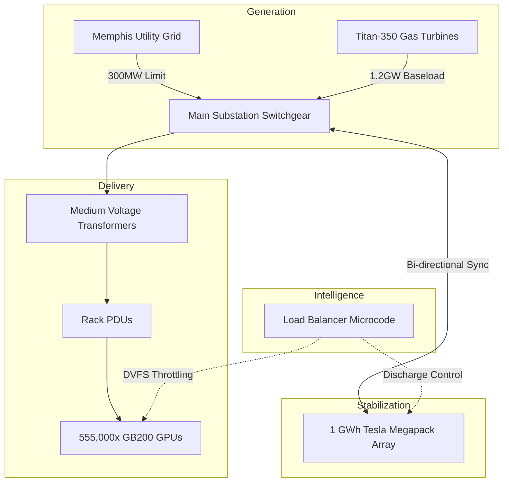

# xai-colossus-energy

> **Gigawatt-Scale Microgrid & Behind-the-Meter Power Architecture**

---

## 🛑 The Challenge: The Grid Cannot Keep Up

To train the Grok 5 model family in record time, Colossus 2 requires **1.5 Gigawatts** of continuous, high-fidelity electrical power. 
- Traditional local utilities (e.g., TVA) take 3–5 years to permit and build transmission substations for loads exceeding 200 MW.
- AI training loads are highly volatile. A synchronized AllReduce operation across 555,000 GPUs can cause a microsecond-scale power spike of 300+ MW, threatening to collapse grid frequency.

---

## ⚡ The Solution: The Sovereign Microgrid

This repository manages the design, integration, and load-balancing microcode for the world's most advanced behind-the-meter energy island.

### 1. Primary Generation: Mobile Gas Turbines
- **Hardware:** Deployment of **Solar Turbines (Titan-350 and Taurus 70)** running on natural gas.
- **Advantage:** Bypasses years of transmission line permitting. Delivers scalable baseload power directly to the data center switchgear.

### 2. Frequency Buffering: The Megapack Array
- **Storage:** Over **1 GWh of Tesla Megapacks** deployed as a grid shock-absorber.
- **Function:** Absorbs the microsecond "spikes" of GPU training runs. The turbines provide the steady baseload, while the batteries handle the delta, preventing brownouts.

### 3. Substation & Switchgear Orchestration
- Integration of custom medium-voltage (MV) transformers.
- **Microcode Sync:** The `xai-colossus-microcode` flash controller continuously feeds state data to the energy load balancer, executing DVFS (Dynamic Voltage and Frequency Scaling) across the GPUs if the Megapack buffer runs low.

---

## 🗺️ Power Topology

---

## 📊 Engineering Impact

| Metric | Traditional Utility | Sovereign Microgrid |
|--------|---------------------|---------------------|
| **Deployment Time** | 36–60 Months | **4–6 Months** |
| **Grid Stability** | Vulnerable to AI Spikes | **Isolated & Buffered** |
| **Peak Capacity** | 200–300 MW | **1.5 GW+** |
| **Redundancy** | Grid-dependent | **N+1 Turbine/Battery** |

---

## 🔐 About This Repository

Contains the SCADA integration layers, turbine telemetry parsers, and Megapack discharge algorithms required to operate Colossus 2 as an independent energy state.

Part of the [GlacierEQ xAI Engineering Suite](https://github.com/GlacierEQ/xai-colossus-community).  
*Powering the future of intelligence.*
