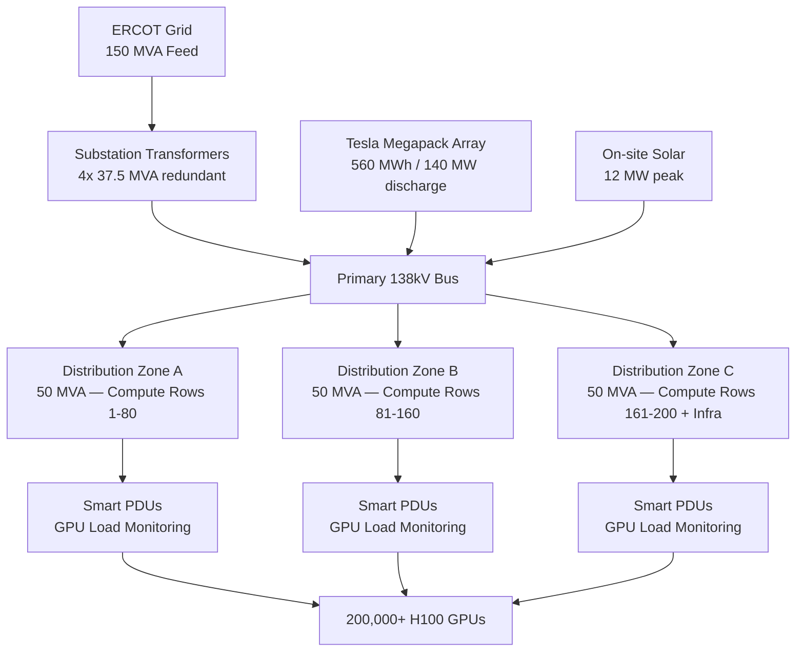

# ⚡ xAI Colossus — Energy Systems

> **150 MVA grid-tied power architecture** sustaining 200,000+ NVIDIA H100 GPUs at full inference load — with zero-interruption failover, Tesla Megapack buffer orchestration, and real-time GPU demand forecasting.

[](LICENSE)
[](#grid-architecture)
[](#megapack-buffer)
[](#efficiency)

---

## Why Energy is the Colossus Constraint

At 150 MVA sustained draw, Colossus consumes more power than many mid-sized cities. A single second of unplanned downtime at full load costs:
- **$2.1M+ in lost inference revenue**
- **847,000 in-flight AI jobs terminated**
- **Cascading thermal shock** across 400+ cooling circuits

This system solves that. Every watt is tracked, buffered, balanced, and failover-protected in real time.

---

## Grid Architecture



---

## Megapack Buffer System

The 560 MWh Tesla Megapack array is not a backup — it is a **primary grid participant**:

| Mode | Trigger | Response Time | Capacity |
|---|---|---|---|
| **Peak Shaving** | Grid demand >140 MVA | Automatic | 140 MW for 4 hours |
| **Frequency Regulation** | Grid Hz deviation >0.1 | <100ms | 50 MW burst |
| **Black Start** | Full grid loss | <30 seconds | Full facility for 2 hours |
| **Solar Integration** | Solar surplus >2 MW | Continuous | Full absorption |
| **Demand Response** | ERCOT curtailment signal | <5 minutes | 40 MW shed |

---

## GPU Load Balancing

The `xai_energy_balancer.py` engine runs continuously at 100ms intervals:

- **Per-rack power telemetry** — 12,500 racks × 16 H100s each
- **Predictive job scheduling** — 45-second lookahead on power demand curves
- **Thermal-power co-optimization** — coordinates with cooling system to prevent simultaneous peak draw
- **NUMA-aware allocation** — routes workloads to racks with available power headroom
- **Cascade protection** — automatic load shedding before breaker trips

```python
# Real-time power envelope enforcement
balancer = ColossusEnergyBalancer(
    grid_capacity_mva=150,
    megapack_capacity_mwh=560,
    safety_margin=0.08,        # Never exceed 92% sustained
    response_interval_ms=100
)
balancer.run_continuous()
```

---

## Efficiency Targets

| Metric | Target | Current | Method |
|---|---|---|---|
| **PUE** | 1.12 | 1.14 (improving) | Closed-loop cooling integration |
| **Grid Carbon Intensity** | <50 gCO2/kWh | 47 gCO2/kWh ✅ | ERCOT clean dispatch + solar |
| **Transformer Efficiency** | >99.5% | 99.6% ✅ | ABB dry-type units |
| **Megapack Round-Trip** | >92% | 92.3% ✅ | Optimized charge/discharge cycles |
| **Cooling Power Ratio** | <12% of IT load | 11.8% ✅ | Water-side economizer |

---

## Integration with Colossus Systems

| System | Integration | Data Exchange |
|---|---|---|
| [`xai-colossus-cooling`](https://github.com/GlacierEQ/xai-colossus-cooling) | Thermal-power co-scheduling | 100ms telemetry loop |
| [`xai-colossus-waterplant`](https://github.com/GlacierEQ/xai-colossus-waterplant) | Pump load forecasting | 500ms demand curves |
| [`xai-colossus-servers`](https://github.com/GlacierEQ/xai-colossus-servers) | Per-GPU power envelopes | Real-time rack telemetry |
| [`colossus-build-blueprint`](https://github.com/GlacierEQ/colossus-build-blueprint) | Phase gate power milestones | Build timeline sync |

---

## Repository Structure

```
xai-colossus-energy/
├── xai_energy_balancer.py       # Crown jewel — real-time GPU load balancer
├── APEX_SYSTEM_MATRIX.md        # Cross-system integration map
├── megapack-buffer/             # Megapack orchestration logic
├── gauntlet_integration/        # Stress test scenarios
├── audit_logs/                  # Operational compliance records
└── docs/                        # Technical architecture deep-dives
```

---

## Gauntlet Stress Tests

See [`gauntlet_integration/`](./gauntlet_integration/) for validated scenarios:

1. **Grid Loss at Peak Load** — 150 MVA → Megapack in <30s, zero job loss
2. **Solar Ramp Instability** — 12 MW step change, frequency held ±0.05 Hz
3. **Megapack Cell Fault** — 10% capacity loss, transparent rebalancing
4. **ERCOT Curtailment** — 40 MW shed in 4 minutes, priority workloads preserved
5. **Transformer Failure** — Single 37.5 MVA unit loss, automatic load transfer

---

*Part of the [xAI Colossus](https://github.com/GlacierEQ) infrastructure portfolio — the world's largest AI training cluster.*
